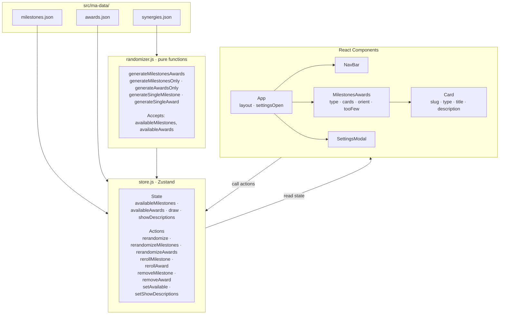
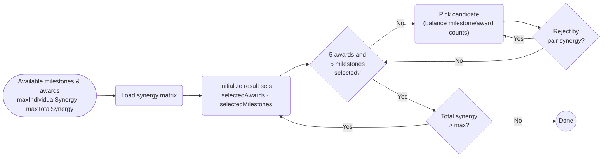

# terraforming-mars-aid

A randomizer for Milestones & Awards in the Terraforming Mars board game. Open the app, configure which expansions you own in Settings, and roll.

[Play](https://matbonet.github.io/terraforming-mars-aid)

---

# Architecture

---

# Randomization method

---

# About

Built with React, Zustand, and bare CSS.
