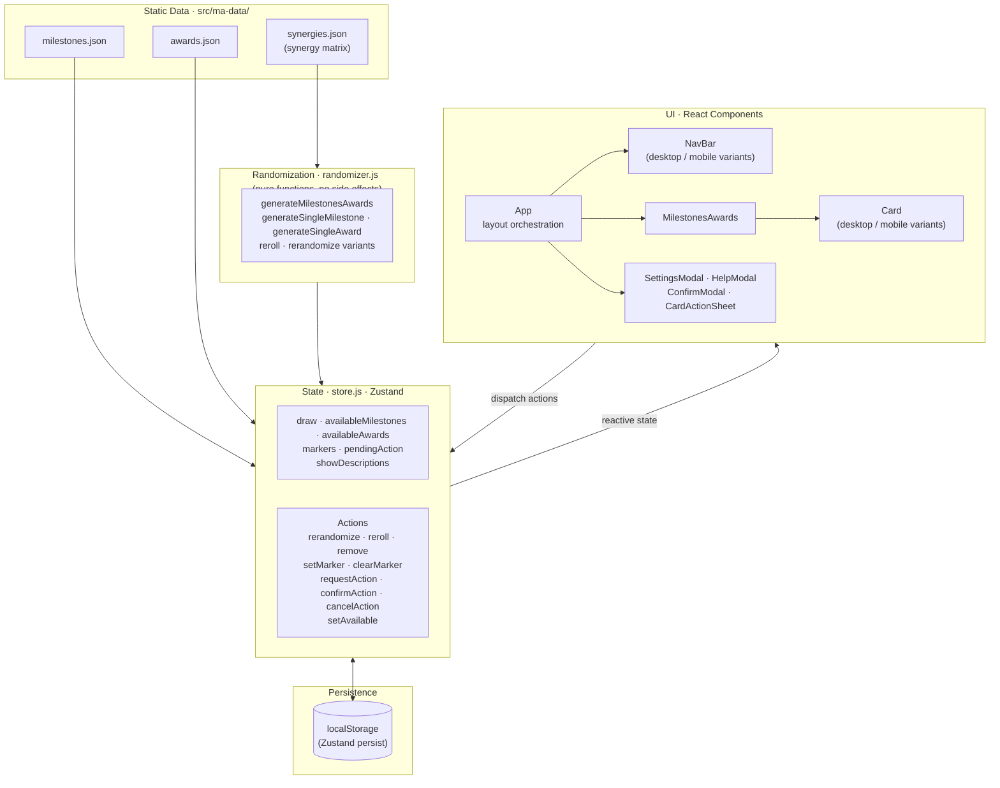

# terraforming-mars-aid

A randomizer for Milestones & Awards in the Terraforming Mars board game. Recommended to use with the [official Milestones & Awards](https://fryxgames.se/product/terraforming-mars-milestones-awards/) expansion (unaffiliated).

[Try it!](https://matbonet.github.io/terraforming-mars-aid)

---

## Getting started

```bash
npm install
npm start       # dev server at localhost:3000
npm run build   # production build
```

---

## Randomization

Cards are drawn one at a time, alternating between Milestones and Awards to keep counts balanced. Each candidate is evaluated against all already-selected cards using a **synergy matrix** (`src/ma-data/synergies.json`) — a nested object where every `{ slug1: { slug2: score } }` pair is stored with keys in alphabetical order.

High-synergy pairs are rejected probabilistically via a linear-decay curve: the higher the synergy score, the lower the chance the pair is accepted. Once all 10 slots are filled, the total synergy across all selected cards is checked against a configurable ceiling; if exceeded, the whole draw restarts. This keeps results diverse without making low-synergy combos the only possible outcome.

Individual-card rerolls and per-section rerandomizations follow the same rules, applied only within the affected subset.

---

## Interface

The app adapts to two distinct layouts based on input capability (not screen size):

- **Desktop** — horizontal or vertical card grid with per-card reroll/exclude buttons on hover, section-level rerandomize pills, and a settings button in the top bar.
- **Mobile** (touch devices) — full-screen card layout with a floating bottom action bar for Randomize and Settings. Cards open an action sheet on tap for per-card actions.

Player markers (colored cubes) can be placed on cards to track claims during a game. Up to 3 Milestones and 3 Awards can be claimed; unclaimed cards dim once the limit is reached. Rerolling while markers are active prompts for confirmation.

---

## Architecture



---

## About

Built with React, Zustand, and bare CSS.

> Unaffiliated with FryxGames or Terraforming Mars.
